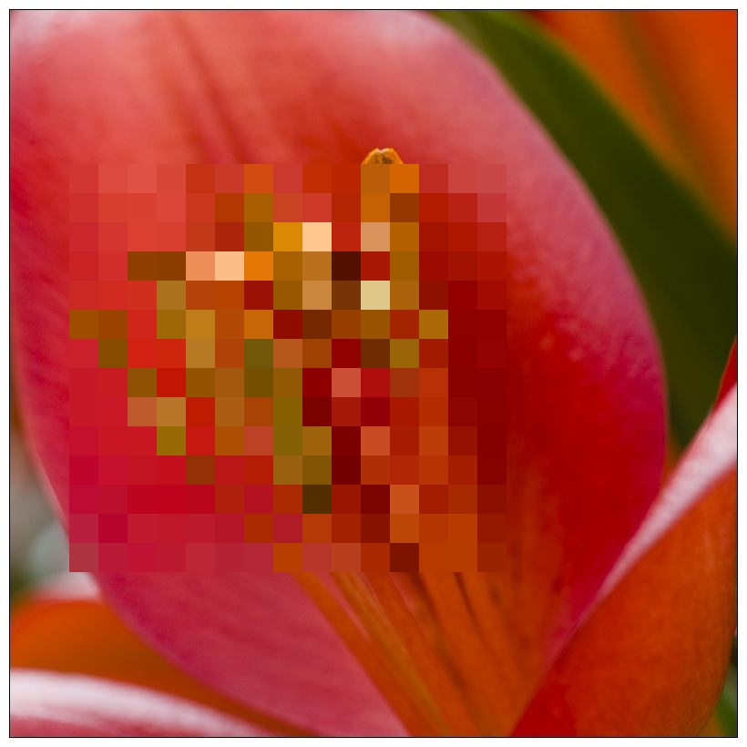
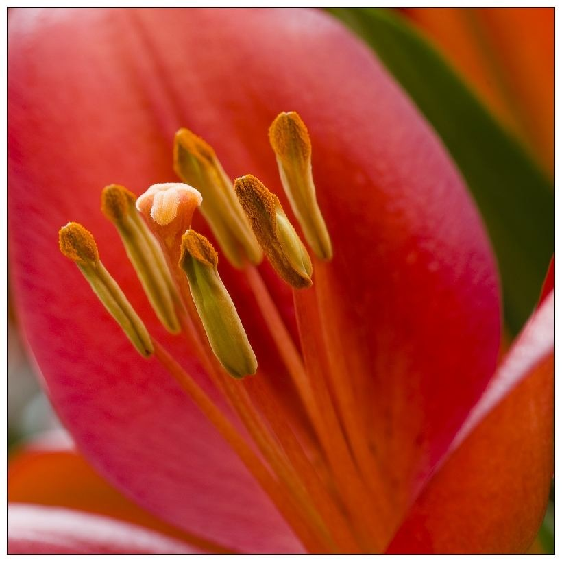

# Demosaic
Use GAN to remove mosaic.
<div align="center">
  
  
</div>

## Getting Started
#### Prerequisites
  - Linux, Mac OS, Windows
  - Python 3.5+
  - ffmpeg 3.4.6
  - Pytorch 1.0+
  - NVIDIA GPU(with more than 6G memory) + CUDA CuDNN<br>
#### Dependencies
This code depends on opencv-python, torchvision, matplotlib available via pip install.
#### Clone this repo
```bash
git clone https://github.com/GitHubZiqiangZhou/demosaic
cd demosaic
```
## Make training datasets
Use addmosaic model to make video datasets(Require addmosaic pre-trained model. This is better for processing video mosaics).

Train addmosaic pre-trained model, please refer to [README_addmosaic.md](./README_addmosaic.md).

```bash
cd z_make_datasets
python z_make_video_dataset.py --datadir x0.mp4 --savedir ../datasets/demosaic
```
## Training parameters

## Training
```bash
python z_train.py --dataroot ./datasets/demosaic_20200501_286to256 --name demosaic_20200501_286to256_random --loadSize 286 --fineSize 256 --resize_or_crop crop --label_nc 0 --no_instance --niter 100 --niter_decay 100 --tf_log --gpu_ids 1 --continue_train
```
## Testing
```bash
# for images
python z_test.py  --dataroot ./datasets/demosaic_20200501_286to256 --name demosaic_20200501_286to256_random --loadSize 256 --fineSize 256 --label_nc 0 --no_instance --gpu_ids 0
# for video
python z_demosaic.py --name demosaic_20200501_286to256_random --media_path x.mp4
```
## Acknowledgments
This code borrows heavily from [[pix2pixHD]](https://github.com/NVIDIA/pix2pixHD) [[DeepMosaics]](https://github.com/HypoX64/DeepMosaics.git) [[Pytorch-UNet]](https://github.com/milesial/Pytorch-UNet) [[BiSeNet]](https://github.com/ooooverflow/BiSeNet).

